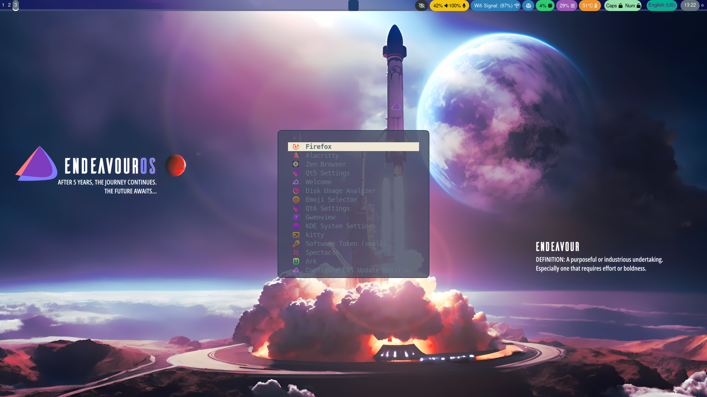

# EndeavourOS-Dotfiles
My EndeavourOS dotfiles for hackclub's riceathon

# Purpose

This is my dotfiles for my Endeavour OS Mercury for RPI5, which I riced using :

- Hyprland
- Waybar
- alacritty
- zsh
- oh-my-zsh
- powerlevel10k
and fuzzel

# Gallery

  

  

  

  
